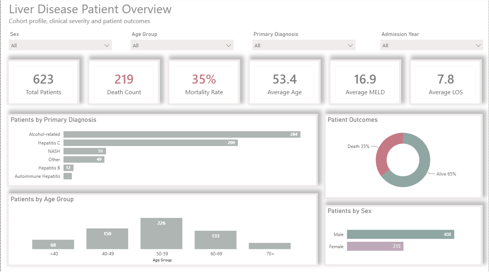
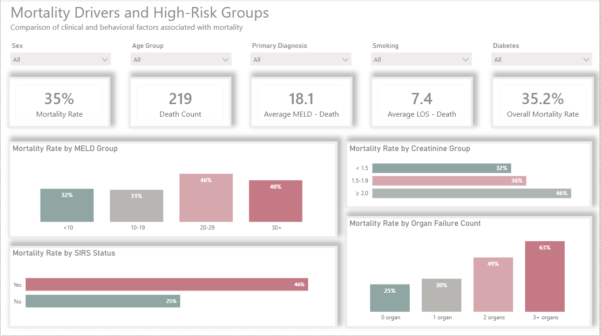
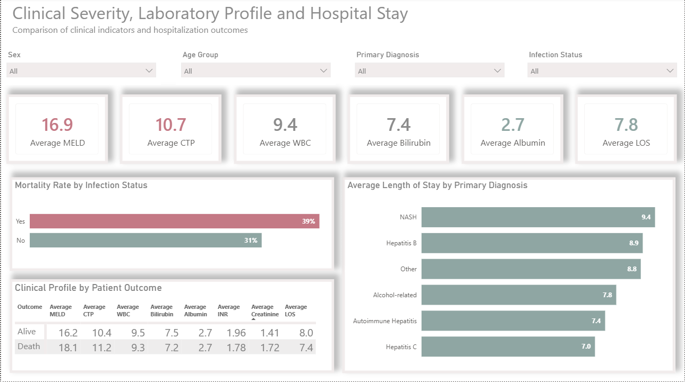

# Liver Disease Patient Analysis

## Project Overview

This project presents an interactive Power BI analysis of a liver disease patient dataset. The report was developed to summarize the patient population, evaluate mortality patterns, compare clinical and laboratory indicators, and identify patient groups associated with higher clinical risk.

The analysis is descriptive and observational. The findings reflect associations within the available dataset and should not be interpreted as causal relationships or as a clinical prediction model.

## Dashboard Preview

### 1. Liver Disease Patient Overview

This page provides an overall view of the patient population, including demographic distribution, primary diagnosis, patient outcome, and the main clinical KPIs (Key Performance Indicators).



### 2. Mortality Drivers and High-Risk Groups

This page examines mortality patterns across MELD (Model for End-Stage Liver Disease) groups, SIRS (Systemic Inflammatory Response Syndrome) status, organ failure count, and creatinine categories. It also supports subgroup analysis using filters for sex, age group, primary diagnosis, smoking, and diabetes.



### 3. Clinical Severity, Laboratory Profile and Hospital Stay

This page compares clinical severity and laboratory indicators across patient outcomes, evaluates mortality by infection status, and compares average length of stay across primary diagnosis groups.



## Project Objectives

The project was designed to:

- summarize the demographic and clinical characteristics of the patient population;
- monitor key indicators such as patient count, mortality rate, age, MELD score, and length of stay;
- examine mortality patterns across MELD groups, SIRS status, organ failure count, and creatinine categories;
- compare mortality between patients with and without recorded infection;
- compare clinical and laboratory indicators between surviving and deceased patients;
- evaluate average length of stay across primary diagnosis groups;
- provide interactive filtering by demographic, diagnostic, and clinical variables.

## Dataset Summary

The analysis includes **623 patients** with liver disease.

The main indicators are:

- **Total patients:** 623
- **Deaths:** 219
- **Mortality rate:** 35.2%
- **Average age:** 53.4 years
- **Average MELD score:** 16.9
- **Average length of stay:** 7.8 days

Some categorical fields contained missing or unrecorded values. These values were excluded from selected category-level visuals when they did not support meaningful interpretation, while the corresponding patient records were retained in the overall dataset. For this reason, totals in some charts may not always equal 623.

## Data Source

The dataset was provided as part of an educational Power BI project. The raw patient-level data is not redistributed in this repository.

## Data Preparation

Data preparation was completed in Power Query. The main steps included:

- reviewing data quality and column types;
- standardizing text fields;
- handling missing and unrecorded values;
- preserving missing numeric values instead of replacing them with artificial measurements;
- validating clinically bounded score fields;
- creating analytical groups for age, MELD score, creatinine, organ failure count, and length of stay;
- deriving fields such as admission year and mortality flag;
- creating separate analytical fields when original values required validation before reporting.

The original source table was preserved, while the transformed table was used for analysis and dashboard development.

## Data Model and Measures

The Power BI model includes calculated fields and DAX (Data Analysis Expressions) measures for:

- total patient count;
- death count;
- mortality rate;
- average age;
- average MELD score;
- average CTP (Child-Turcotte-Pugh) score;
- average WBC (White Blood Cell count);
- average bilirubin;
- average albumin;
- average INR (International Normalized Ratio);
- average creatinine;
- average length of stay;
- mortality rates across clinical and diagnostic groups.

Most analytical measures respond dynamically to slicers and visual interactions. The Overall Mortality Rate measure remains fixed as a benchmark for comparison.

## Key Findings

### Patient Profile

Alcohol-related liver disease was the most common primary diagnosis, with **284 patients**, followed by hepatitis C with **209 patients**. Together, these two groups represented approximately **79%** of the study population.

The largest age group was 50–59 years, with **226 patients**. Most patients were between 40 and 69 years of age. Men represented a larger share of the dataset than women; however, mortality rates were very similar between the two sexes.

### Mortality and Disease Severity

The clearest mortality pattern was observed in the number of failed organs. Mortality increased from **25%** among patients with no organ failure to **30%** with one failed organ, **49%** with two failed organs, and **63%** with three or more failed organs.

Patients with positive SIRS status had a mortality rate of **46%**, compared with **25%** among patients without SIRS.

Mortality also increased across creatinine groups, from **32%** for values below 1.5 to **36%** for values between 1.5 and 1.9, and **46%** for values of 2.0 or higher.

Patients with MELD scores of 20 or higher generally had higher mortality than patients in lower MELD groups. However, the pattern was not completely linear across all categories. MELD was therefore interpreted together with organ failure, renal function, infection status, and inflammatory response.

### Clinical and Laboratory Comparison

Deceased patients had a higher average MELD score than surviving patients (**18.1 vs. 16.2**) and a higher average CTP score (**11.2 vs. 10.4**). Their average creatinine level was also higher (**1.72 vs. 1.41**).

Patients with a recorded infection had a mortality rate of **39%**, compared with **31%** among patients without infection.

Average length of stay varied by diagnosis. NASH (Non-Alcoholic Steatohepatitis) had the highest average stay at **9.4 days**, followed by hepatitis B at **8.9 days**. These comparisons should be interpreted cautiously because some diagnostic groups contained relatively few patients.

## Main Interpretation

Higher mortality was observed among patients with multiple organ failure, positive SIRS status, elevated creatinine, and higher MELD scores. Among the examined indicators, the number of failed organs showed the strongest and most consistent increase in mortality.

These findings are intended to support exploratory analysis and reporting. They do not establish causality and should not be used independently for clinical decision-making.

## Tools Used

- Power BI Desktop
- Power Query
- DAX
- Interactive dashboard design
- Clinical KPI reporting

## Repository Structure

```text
liver-disease-patient-analysis/
├── README.md
├── Dashboard/
│   └── Liver_Disease_Analysis.pbix
└── images/
    ├── patient_overview.png
    ├── mortality_drivers.png
    └── clinical_profile.png
```

## Power BI File

The interactive Power BI report is available here:

[Download the Power BI report](Dashboard/Liver_Disease_Analysis.pbix)

## Notes

- The raw patient-level dataset is not included in this repository.
- Missing or unrecorded categories were retained in the data model but excluded from selected visuals when they did not support meaningful interpretation.
- The project is intended for portfolio and analytical demonstration purposes.

## Author

**Mahsa Kazempour**  
Data Analyst
